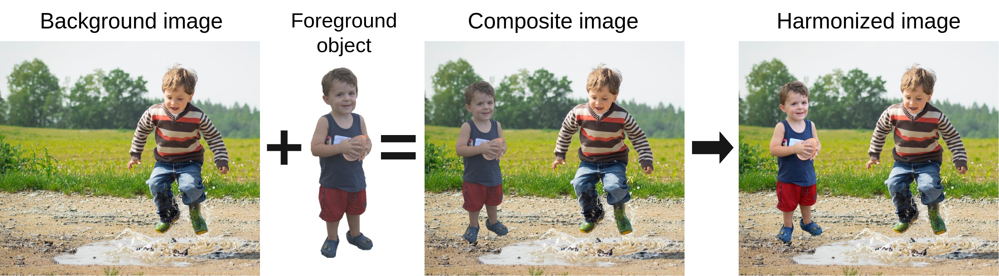

# Foreground-aware Semantic Representations for Image Harmonization

<p align="center">
  
</p>

This repository contains the official PyTorch implementation of the following paper:
> **Foreground-aware Semantic Representations for Image Harmonization**<br>
> [Konstantin Sofiiuk](https://github.com/ksofiyuk), [Polina Popenova](https://github.com/polyhex-sqr), [Anton Konushin](https://scholar.google.com/citations?user=ZT_k-wMAAAAJ)<br>
> Samsung AI Center Moscow<br>
> https://arxiv.org/abs/2006.00809
>
> **Abstract:**
> Image harmonization is an important step in photo editing to achieve visual consistency in composite images by adjusting the appearances of foreground to make it compatible with background.
> Previous approaches to harmonize composites are based on training of encoder-decoder networks from scratch, which makes it challenging for a neural network to learn a high-level representation of objects.
> We propose a novel architecture to utilize the space of high-level features learned by a pre-trained classification network.
> We create our models as a combination of existing encoder-decoder architectures and a pre-trained foreground-aware deep high-resolution network.
> We extensively evaluate the proposed method on existing image harmonization benchmark and set up a new state-of-the-art in terms of MSE and PSNR metrics.

## Setting up an environment

This framework is built using Python 3.6 and relies on the PyTorch 1.4.0+. The following command installs all necessary packages:

```.bash
pip3 install -r requirements.txt
```

You can also use our [Dockerfile](./Dockerfile) to build a container with configured environment. 

If you want to run training or testing, you must configure the paths to the datasets in [config.yml](./config.yml).

## Datasets
We train and evaluate all our models on the [iHarmony4 dataset](https://github.com/bcmi/Image_Harmonization_Datasets).
It contains 65742 training and 7404 test objects. Each object is a triple consisting of real image, composite image and foreground mask.

Before training we resize HAdobe5k subdataset so that each side is smaller than 1024.
The resizing script is provided in [resize_hdataset.ipynb](./notebooks/resize_hdataset.ipynb).

Don't forget to change the paths to the datasets in [config.yml](./config.yml) after downloading and unpacking.

## Training

We provide the scripts for training our models on images of size 256 and 512.
For each experiment, a separate folder is created in the `./harmonization_exps` with Tensorboard logs, text logs, visualization and model's checkpoints.
You can specify another path in the [config.yml](./config.yml) (see `EXPS_PATH` variable).

Start training with the following commands:
```.bash
python3 train.py <model-script-path> --gpus=0 --workers=4 --exp-name=first-try

# iDIH: fully convolutional Encoder-Decoder with output image blending and foreground-normalized MSE loss
python3 train.py models/fixed256/improved_dih.py --gpus=0 --workers=4 --exp-name=first-try

# HRNet18s-V2p + iDIH: feature pyramid of 4 HRNet18-small-V2 outputs is concatenated to 4 outputs of the iDIH encoder
python3 train.py models/fixed256/hrnet18_idih.py --gpus=0 --workers=4 --exp-name=first-try

# HRNet18-V2 + iDIH: single output of HRNet18-V2 is concatenated to single output of the iDIH encoder
python3 train.py models/fixed256/hrnet18_idih.py --gpus=0 --workers=4 --exp-name=first-try

# iDIH trained on 512x512
python3 train.py models/crop512/improved_dih.py --gpus=0 --workers=4 --exp-name=first-try
```
To see all training parameters, run `python3 train.py --help`.

We used pre-trained HRNetV2 models from the [official repository](https://github.com/HRNet/HRNet-Image-Classification).
To train one of our models with HRNet backbone, download HRNet weights and specify their path in [config.yml](./config.yml) (see `IMAGENET_PRETRAINED_MODELS` variable).

## Evaluation
We provide scripts to both evaluate and get predictions from any model.
To do that, we specify all models configs in [mconfigs](./iharm/mconfigs).
To evaluate a model different from the provided, a new config entry should be added.

You can specify the checkpoints path in [config.yml](./config.yml) (see `MODELS_PATH` variable) in advance
and provide the scripts only with a checkpoint name instead of an absolute checkpoint path.

### Evaluate model
To get metrics table on the iHarmony4 test set run the following command:
```.bash
python3 scripts/evaluate_model.py <model-name> <checkpoint-path> --resize-strategy Fixed256

# iDIH
python3 scripts/evaluate_model.py improved_dih256 /hdd0/harmonization_exps/fixed256/improved_dih/checkpoints/last_checkpoint.pth --resize-strategy Fixed256
```
To see all evaluation parameters run `python3 scripts/evaluate_model.py --help`.

### Get model predictions
To get predictions on a set of images, run the following command:
```.bash
python3 scripts/predict_for_dir.py <model-name> <checkpoint-path> --images <composite-images-path> --masks <masks-path> --resize 256

# iDIH
python3 scripts/evaluate_model.py improved_dih256 /hdd0/harmonization_exps/fixed256/improved_dih/checkpoints/last_checkpoint.pth \
--images /hdd0/datasets/ImageHarmonization/test/composite_images --masks /hdd0/datasets/ImageHarmonization/test/masks \
--resize 256
```
To see all evaluation parameters run `python3 scripts/predict_for_dir.py --help`.

### Jupyter notebook
For interactive models testing with samples visualization see [eval_and_vis_harmonization_model.ipynb](./notebooks/eval_and_vis_harmonization_model.ipynb).

## Results
We provide metrics and pre-trained weights for several models trained on images of size 256x256 augmented with horizontal flip and random resized crop.
Metric values may differ slightly from the ones in the paper since all the models were retrained from scratch with the new codebase.

Pre-trained models with corresponding names of model configs (see [Evaluation](#evaluation)):
| Model                      | Download Link                                  | Name in [mconfigs](./iharm/mconfigs) |
|:--------------------------:|:----------------------------------------------:|:-------------------------------------:|
| iDIH256                    | [idih256.pth][idih256]                         |improved_dih256                        |
| iSSAM256                   | [issam256.pth][issam256]                       |improved_ssam256                       |
| DeepLab-ResNet34 + iDIH256 | [deeplab_idih256.pth][deeplab_idih256]         |deeplab_r34_idih256                    |
| HRNet18s + iDIH256         | [hrnet18s_idih256.pth][hrnet18s_idih256]       |hrnet18s_idih256                       |
| HRNet18 + iDIH256          | [hrnet18_idih256.pth][hrnet18_idih256]         |hrnet18_idih256                        |
| HRNet18 pyramid + iDIH256  | [hrnet18_v2p_idih256.pth][hrnet18_v2p_idih256] |hrnet18_v2p_idih256                    |
| HRNet32 + iDIH256          | [hrnet32_idih256.pth][hrnet32_idih256]         |hrnet32_idih256                        |

[idih256]: https://github.com/saic-vul/image_harmonization/releases/download/v1.0/idih256.pth
[issam256]: https://github.com/saic-vul/image_harmonization/releases/download/v1.0/issam256.pth
[deeplab_idih256]: https://github.com/saic-vul/image_harmonization/releases/download/v1.0/deeplab_idih256.pth
[hrnet18s_idih256]: https://github.com/saic-vul/image_harmonization/releases/download/v1.0/hrnet18s_idih256.pth
[hrnet18_idih256]: https://github.com/saic-vul/image_harmonization/releases/download/v1.0/hrnet18_idih256.pth
[hrnet18_v2p_idih256]: https://github.com/saic-vul/image_harmonization/releases/download/v1.0/hrnet18_v2p_idih256.pth
[hrnet32_idih256]: https://github.com/saic-vul/image_harmonization/releases/download/v1.0/hrnet32_idih256.pth

Evaluation metrics:
<table class="tg">
  <tr>
    <th class="tg-0pky">Model</th>
    <th class="tg-0pky" colspan="2">HCOCO</th>
    <th class="tg-0pky" colspan="2">HAdobe5k</th>
    <th class="tg-0pky" colspan="2">HFlickr</th>
    <th class="tg-0pky" colspan="2">Hday2night</th>
    <th class="tg-0pky" colspan="2">All</th>
  </tr>
  <tr>
    <td class="tg-0pky">Evaluation metric</td>
    <td class="tg-0pky">MSE</td>
    <td class="tg-0pky">PSNR</td>
    <td class="tg-0pky">MSE</td>
    <td class="tg-0pky">PSNR</td>
    <td class="tg-0pky">MSE</td>
    <td class="tg-0pky">PSNR</td>
    <td class="tg-0pky">MSE</td>
    <td class="tg-0pky">PSNR</td>
    <td class="tg-0pky">MSE</td>
    <td class="tg-0pky">PSNR</td>
  </tr>
  <tr>
    <th class="tg-0pky" colspan="11">Base models</th>
  </tr>
  <tr>
    <td class="tg-0pky">iDIH256</td>
    <td class="tg-0pky">19.58</td>
    <td class="tg-0pky">38.34</td>
    <td class="tg-0pky">30.84</td>
    <td class="tg-0pky">36.00</td>
    <td class="tg-0pky">84.74</td>
    <td class="tg-0pky">32.58</td>
    <td class="tg-0pky">50.05</td>
    <td class="tg-0pky">37.10</td>
    <td class="tg-0pky">30.70</td>
    <td class="tg-0pky">36.99</td>
  </tr>
  <tr>
    <td class="tg-0pky">iSSAM256</td>
    <td class="tg-0pky">16.48</td>
    <td class="tg-0pky">39.16</td>
    <td class="tg-0pky">22.60</td>
    <td class="tg-0pky">37.24</td>
    <td class="tg-0pky">69.67</td>
    <td class="tg-0pky">33.56</td>
    <td class="tg-0pky">40.59</td>
    <td class="tg-0pky">37.72</td>
    <td class="tg-0pky">24.65</td>
    <td class="tg-0pky">37.95</td>
  </tr>
  <tr>
    <th class="tg-0pky" colspan="11">iDIH256 with backbone</th>
  </tr>
  <tr>
    <td class="tg-0pky">DeepLab-ResNet34</td>
    <td class="tg-0pky">17.68</td>
    <td class="tg-0pky">38.97</td>
    <td class="tg-0pky">28.13</td>
    <td class="tg-0pky">36.33</td>
    <td class="tg-0pky">70.89</td>
    <td class="tg-0pky">33.25</td>
    <td class="tg-0pky">56.17</td>
    <td class="tg-0pky">37.25</td>
    <td class="tg-0pky">27.37</td>
    <td class="tg-0pky">37.53</td>
  </tr>
  <tr>
    <td class="tg-0pky">HRNet18s</td>
    <td class="tg-0pky">14.30</td>
    <td class="tg-0pky">39.52</td>
    <td class="tg-0pky">22.57</td>
    <td class="tg-0pky">37.18</td>
    <td class="tg-0pky">63.03</td>
    <td class="tg-0pky">33.70</td>
    <td class="tg-0pky">51.20</td>
    <td class="tg-0pky">37.69</td>
    <td class="tg-0pky">22.82</td>
    <td class="tg-0pky">38.15</td>
  </tr>
  <tr>
    <td class="tg-0pky">HRNet18</td>
    <td class="tg-0pky">13.79</td>
    <td class="tg-0pky">39.62</td>
    <td class="tg-0pky">25.44</td>
    <td class="tg-0pky">36.91</td>
    <td class="tg-0pky">60.63</td>
    <td class="tg-0pky">33.88</td>
    <td class="tg-0pky">44.94</td>
    <td class="tg-0pky">37.74</td>
    <td class="tg-0pky">22.99</td>
    <td class="tg-0pky">38.16</td>
  </tr>
  <tr>
    <td class="tg-0pky">HRNet18 pyramid</td>
    <td class="tg-0pky">14.10</td>
    <td class="tg-0pky">39.56</td>
    <td class="tg-0pky">24.47</td>
    <td class="tg-0pky">37.04</td>
    <td class="tg-0pky">62.13</td>
    <td class="tg-0pky">33.90</td>
    <td class="tg-0pky">47.74</td>
    <td class="tg-0pky">37.46</td>
    <td class="tg-0pky">23.10</td>
    <td class="tg-0pky">38.15</td>
  </tr>
  <tr>
    <td class="tg-0pky">HRNet32</td>
    <td class="tg-0pky">14.00</td>
    <td class="tg-0pky">39.71</td>
    <td class="tg-0pky">23.04</td>
    <td class="tg-0pky">37.13</td>
    <td class="tg-0pky">57.55</td>
    <td class="tg-0pky">34.06</td>
    <td class="tg-0pky">53.70</td>
    <td class="tg-0pky">37.70</td>
    <td class="tg-0pky">22.22</td>
    <td class="tg-0pky">38.29</td>
  </tr>
</table>

## License
The code is released under the MPL 2.0 License. MPL is a copyleft license that is easy to comply with. You must make the source code for any of your changes available under MPL, but you can combine the MPL software with proprietary code, as long as you keep the MPL code in separate files.

## Citation
If you find this work is useful for your research, please cite our paper:

```
@article{sofiiuk2020harmonization,
  title={Foreground-aware Semantic Representations for Image Harmonization},
  author={Konstantin Sofiiuk, Polina Popenova, Anton Konushin},
  journal={arXiv preprint arXiv:2006.00809},
  year={2020}
}
```
